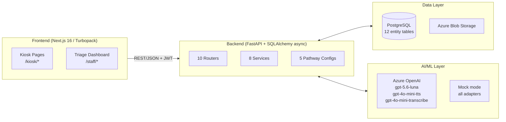

# MediKiosk — AI Clinical History Software Platform

> **SIH 2026 Problem Statement SIH26047 · Ministry of AYUSH · Smart Automation**
>
> An AI-powered, self-service clinical history intake platform for Indian government hospital OPDs — enabling patients to record structured history through touch/voice, digitize prior medical documents, and deliver a physician-ready summary before the consultation begins.

---

## Table of Contents

1. [System Flow (Mermaid)](#system-flow)
2. [Architecture Overview](#architecture-overview)
3. [API Inventory — Implemented vs Exposed in Frontend](#api-inventory)
4. [SIH26047 Requirement Accomplishment Matrix](#sih26047-accomplishment)
5. [What's Left / Gaps](#whats-left)
6. [Quick Start](#quick-start)

---

## System Flow

```mermaid
flowchart TD
    subgraph Patient["👤 Patient — Kiosk UI (Next.js)"]
        P1["/kiosk/start\nSelect complaint & language"]
        P2["/kiosk/:id/consent\nAudio-guided consent form"]
        P3["/kiosk/:id/intake\nAdaptive Q&A\n(touch choices + TTS audio)"]
        P4["Document Upload\n(PDF / JPEG / PNG)"]
        P5["Intake submitted"]
    end

    subgraph Backend["⚙️ FastAPI Backend"]
        direction TB
        B1["POST /encounters\nCreate Patient + Encounter + JWT"]
        B2["POST /encounters/:id/consents\nRecord consent, status → IN_PROGRESS"]
        B3["GET /encounters/:id/intake/next-question\nPathway engine — adaptive branching"]
        B4["POST /encounters/:id/intake/responses\nSave answer → ClinicalFact + RedFlag rules"]
        B5["POST /encounters/:id/audio/prompts/next-question\nTTS (OpenAI / mock) → WAV\nCached in Azure Blob + question_audio_prompts DB"]
        B6["POST /encounters/:id/documents\nUpload → Azure Blob Storage"]
        B7["POST /documents/:id/extractions\nOCR vision (GPT-5.6 Luna / PyMuPDF)\nExtract entities → AssistiveArtifact"]
        B8["POST /encounters/:id/submit\nEncounter status → SUBMITTED"]
        B9["POST /encounters/:id/speech/transcriptions\nASR — Azure OpenAI STT → transcript"]
    end

    subgraph Staff["🏥 Staff — Triage Dashboard (Next.js)"]
        S1["/staff/triage\nAll patients table\n+ Red-flag priority queue"]
        S2["/staff/encounters/:id\nClinician encounter review\nFacts · Red flags · Documents · Summary"]
    end

    subgraph StaffAPI["⚙️ Staff API Endpoints"]
        direction TB
        SA1["POST /auth/login → JWT"]
        SA2["GET /triage/encounters\nAll encounters (newest first)"]
        SA3["GET /triage/queue\nActive red-flag queue only"]
        SA4["POST /red-flags/:id/acknowledgements"]
        SA5["GET /clinician/encounters/:id\nFull record for physician view"]
        SA6["POST /encounters/:id/summary/generations\nAI summary (GPT-5.6 Luna / template)"]
        SA7["PATCH /encounters/:id/summary\nPhysician edits summary"]
        SA8["POST /encounters/:id/summary/verifications\nAccept / reject summary → VERIFIED"]
        SA9["POST /encounters/:id/fhir/exports\nGenerate FHIR R4 Bundle"]
        SA10["POST /documents/:id/extractions/:eid/reviews\nPhysician promotes extracted facts"]
        SA11["GET /encounters/:id/document-timeline\nChronological document + fact timeline"]
    end

    subgraph Infra["☁️ Azure Infrastructure"]
        DB[("PostgreSQL\n12 tables")]
        BLOB["Azure Blob Storage\n• Patient documents\n• Cached TTS audio WAVs"]
        AI["Azure OpenAI\n• gpt-5.6-luna (vision/summary)\n• gpt-4o-mini-tts (TTS)\n• gpt-4o-mini-transcribe (STT)"]
    end

    P1 -->|"POST /encounters"| B1
    B1 -->|"201 + kiosk JWT"| P2
    P2 -->|"POST /encounters/:id/consents"| B2
    B2 -->|"201 consent"| P3
    P3 -->|"GET next-question"| B3
    B3 -->|"question JSON"| P3
    P3 -->|"◖ Play aloud"| B5
    B5 <-->|"Cache hit/miss"| BLOB
    B5 <-->|"Synthesize WAV"| AI
    P3 -->|"POST response"| B4
    B4 -->|"facts + red flags"| DB
    P3 -->|"Upload doc"| B6
    B6 -->|"Store blob"| BLOB
    B6 -->|"Trigger OCR"| B7
    B7 <-->|"Vision extraction"| AI
    B7 -->|"AssistiveArtifact"| DB
    P3 -->|"POST /submit"| B8
    B8 -->|"SUBMITTED"| S1

    Staff -->|"POST /auth/login"| SA1
    S1 -->|"GET /triage/encounters"| SA2
    S1 -->|"GET /triage/queue"| SA3
    S1 -->|"Acknowledge flag"| SA4
    S2 -->|"GET /clinician/encounters/:id"| SA5
    S2 -->|"Generate summary"| SA6
    SA6 <-->|"LLM summary"| AI
    S2 -->|"Edit summary"| SA7
    S2 -->|"Verify summary"| SA8
    SA8 -->|"VERIFIED + FHIR"| SA9
    S2 -->|"Review document OCR"| SA10
    S2 -->|"Document timeline"| SA11

    B1 & B2 & B4 & B6 & B7 & B8 & B9 <--> DB
    SA1 & SA2 & SA3 & SA4 & SA5 & SA6 & SA7 & SA8 & SA9 & SA10 & SA11 <--> DB
```



---

## Architecture Overview



---

## API Inventory

### ✅ Backend APIs Implemented

| # | Method | Endpoint | Purpose | Frontend Wired? |
|---|--------|----------|---------|-----------------|
| 1 | `POST` | `/encounters` | Create patient + encounter + kiosk JWT | ✅ `createEncounter` (`/kiosk/start`) |
| 2 | `GET` | `/encounters/:id` | Get encounter status & pathway | ✅ `getEncounter` (`/kiosk/.../intake`) |
| 3 | `POST` | `/encounters/:id/consents` | Record patient consent | ✅ `recordConsent` (`/kiosk/.../consent`) |
| 4 | `GET` | `/encounters/:id/consents` | List consents | ✅ `listConsents` (`/kiosk/.../intake`) |
| 5 | `POST` | `/encounters/:id/consents/:cid/revocations` | Revoke consent | ✅ `revokeConsent` (`/kiosk/.../intake`) |
| 6 | `GET` | `/encounters/:id/intake/next-question` | Adaptive next question | ✅ `getNextQuestion` (`/kiosk/.../intake`) |
| 7 | `POST` | `/encounters/:id/intake/responses` | Submit answer / create facts | ✅ `submitAnswer` (`/kiosk/.../intake`) |
| 8 | `GET` | `/encounters/:id/facts` | List clinical facts | ✅ `getFacts` (`/kiosk/.../intake`) |
| 9 | `POST` | `/encounters/:id/submit` | Finalize intake | ✅ `submitIntake` (`/kiosk/.../intake`) |
| 10 | `POST` | `/encounters/:id/audio/prompts/next-question` | TTS audio (cached in blob + DB) | ✅ `getNextQuestionAudio` (`QuestionAudioButton`) |
| 11 | `POST` | `/encounters/:id/speech/transcriptions` | ASR voice transcription | ✅ `transcribeAudio` (`VoiceRecordButton`) |
| 12 | `POST` | `/encounters/:id/documents` | Upload document to Azure Blob | ✅ `uploadDocument` (`DocumentUploadSection`) |
| 13 | `GET` | `/encounters/:id/documents` | List encounter documents | ✅ `listEncounterDocuments` (`/staff/...`) |
| 14 | `GET` | `/documents/:id` | Get document metadata | ✅ `getDocumentMetadata` (`/staff/...`) |
| 15 | `GET` | `/documents/:id/content` | Stream document bytes | ✅ `fetchDocumentBlob` (`/staff/...`) |
| 16 | `GET` | `/encounters/:id/document-timeline` | Chronological document + fact history | ✅ `getDocumentTimeline` (`/staff/...`) |
| 17 | `POST` | `/documents/:id/extractions` | OCR/vision extraction | ✅ `extractDocument` (`/staff/...`) |
| 18 | `POST` | `/documents/:id/extractions/:eid/reviews` | Physician promotes facts from OCR | ✅ `reviewDocumentExtraction` (`/staff/...`) |
| 19 | `GET` | `/documents/:id/extractions/latest` | Latest extraction | ✅ `getLatestDocumentExtraction` (`/staff/...`) |
| 20 | `POST` | `/auth/login` | Staff login → JWT | ✅ `login` (`/staff/login`) |
| 21 | `POST` | `/auth/logout` | Revoke staff token | ✅ `logout` (Header sign out) |
| 22 | `GET` | `/auth/me` | Current staff user info | ✅ `getMe` (Header user profile) |
| 23 | `POST` | `/admin/users` | Create staff user (admin only) | ✅ `createStaffUser` (`/staff/admin/users`) |
| 24 | `GET` | `/triage/queue` | Red-flag encounter queue | ✅ `getTriageQueue` (`/staff/triage`) |
| 25 | `GET` | `/triage/encounters` | **All encounters** (any status) | ✅ `getAllEncounters` (`/staff/triage`) |
| 26 | `POST` | `/red-flags/:id/acknowledgements` | Acknowledge red flag | ✅ `acknowledgeFlag` (`/staff/triage`) |
| 27 | `GET` | `/clinician/encounters/:id` | Full encounter for physician | ✅ `getClinicianEncounter` (`/staff/...`) |
| 28 | `POST` | `/encounters/:id/summary/generations` | AI clinical summary generation | ✅ `generateSummary` (`/staff/...`) |
| 29 | `GET` | `/encounters/:id/summary` | Get latest summary | ✅ `getSummary` (`/staff/...`) |
| 30 | `PATCH` | `/encounters/:id/summary` | Physician edits summary | ✅ `updateSummary` (`/staff/...`) |
| 31 | `POST` | `/encounters/:id/summary/verifications` | Accept/reject summary → VERIFIED | ✅ `verifySummary` (`/staff/...`) |
| 32 | `POST` | `/encounters/:id/fhir/exports` | Generate ABDM FHIR R4 Bundle | ✅ `exportFhir` (`/staff/...`) |
| 33 | `GET` | `/encounters/:id/fhir/exports/:eid` | Get FHIR bundle by ID | ✅ `getFhirExportById` (`/staff/...`) |
| 34 | `GET` | `/health` | Health check | ✅ `getHealth` (Home page status badge) |

**Summary: 34 / 34 endpoints wired in the frontend (100% of all endpoints across the platform)**

### APIs Wired in Frontend

```
createEncounter            → POST /encounters
getEncounter               → GET  /encounters/:id
recordConsent              → POST /encounters/:id/consents
listConsents               → GET  /encounters/:id/consents
revokeConsent              → POST /encounters/:id/consents/:cid/revocations
getNextQuestion            → GET  /encounters/:id/intake/next-question
submitAnswer               → POST /encounters/:id/intake/responses
getFacts                   → GET  /encounters/:id/facts
submitIntake               → POST /encounters/:id/submit
getNextQuestionAudio       → POST /encounters/:id/audio/prompts/next-question
transcribeAudio            → POST /encounters/:id/speech/transcriptions
uploadDocument             → POST /encounters/:id/documents
listEncounterDocuments     → GET  /encounters/:id/documents
getDocumentMetadata        → GET  /documents/:id
fetchDocumentBlob          → GET  /documents/:id/content
getDocumentTimeline        → GET  /encounters/:id/document-timeline
extractDocument            → POST /documents/:id/extractions
reviewDocumentExtraction   → POST /documents/:id/extractions/:eid/reviews
getLatestDocumentExtraction→ GET  /documents/:id/extractions/latest
login                      → POST /auth/login
logout                     → POST /auth/logout
getMe                      → GET  /auth/me
createStaffUser            → POST /admin/users
getTriageQueue             → GET  /triage/queue
getAllEncounters           → GET  /triage/encounters
acknowledgeFlag            → POST /red-flags/:id/acknowledgements
getClinicianEncounter      → GET  /clinician/encounters/:id
generateSummary            → POST /encounters/:id/summary/generations
getSummary                 → GET  /encounters/:id/summary
updateSummary              → PATCH /encounters/:id/summary
verifySummary              → POST /encounters/:id/summary/verifications
exportFhir                 → POST /encounters/:id/fhir/exports
getFhirExportById          → GET  /encounters/:id/fhir/exports/:eid
getHealth                  → GET  /health
```

---

## SIH26047 Accomplishment Matrix

### Module A — Conversational Multimodal History Engine

| Requirement | Status | Implementation Detail |
|-------------|--------|----------------------|
| Adaptive clinical history interview | ✅ **Done** | 5 pathways. The flagship chest pathway captures structured HPI onset, character, radiation, severity, timing, and associated symptoms before the existing safety rule. |
| Touch-based multiple-choice for every question | ✅ **Done** | `single_choice` input type; full kiosk UI in `/kiosk/:id/intake` |
| TTS audio prompt for each question | ✅ **Done** | Azure OpenAI TTS (`gpt-4o-mini-tts`); cached in Azure Blob + `question_audio_prompts` DB table; served from cache on repeat |
| Voice / ASR input (speak answers) | ✅ **Done** | `VoiceRecordButton` negotiates a browser-supported WebM/Opus, Ogg/Opus, or M4A/AAC container, preserves its real MIME type/extension, and sends signature-validated audio to Azure OpenAI STT (`gpt-4o-mini-transcribe`) for automatic choice matching |
| AYUSH Dashavidha Pariksha mode | ✅ **Done** | 15-question `ayush-dashavidha-v1` pathway covering all 10 Dashavidha parameters + Ahara-Vihara + Agni + Koshtha + Nidana |
| Red-flag detection + priority alert | ✅ **Done** | Rule engine in `services/intake.py`; `RedFlag` entities; triage queue + acknowledgement workflow |
| Bilingual support | ✅ **Done** | One complete English/Hindi patient flow: check-in, consent, API-delivered question/choice labels, audio guidance, review, document upload, and session hand-off. |
| Accessibility / audio guidance | ✅ **Done** | TTS on every question + audio-guided DPDP consent; large-tap touch design; automatic local kiosk reset after submission or inactivity. |

### Module B — Medical Document Digitization & Intelligence

| Requirement | Status | Implementation Detail |
|-------------|--------|----------------------|
| Document upload (PDF / JPEG / PNG) | ✅ **Done** | `DocumentUploadSection` in Kiosk review; file-signature validation; Azure Blob Storage |
| OCR — printed documents | ✅ **Done** | GPT-5.6 Luna vision + PyMuPDF for native PDF text |
| OCR — handwritten documents | ✅ **Done** | GPT-5.6 Luna vision model handles handwritten content |
| Entity extraction (diagnosis, meds, labs) | ✅ **Done** | `VisionExtraction` schema; entities stored in `AssistiveArtifact.structured_data` |
| Chronological document timeline | ✅ **Done** | `GET /encounters/:id/document-timeline` rendered on clinician review screen |
| Abnormal-value highlighting | 🔶 **Partial** | Entities extracted; visual warning badges on clinician review |
| Document upload UI in kiosk | ✅ **Done** | `DocumentUploadSection` with file-type selector, PDF/JPG preview, and instant OCR trigger |
| Clinician reviews extraction in UI | ✅ **Done** | `Run Document AI / OCR` button + extraction timeline displayed in `/staff/encounters/:id` |

### Module C — Structured History Summary Generator

| Requirement | Status | Implementation Detail |
|-------------|--------|----------------------|
| AI-generated physician-ready summary | ✅ **Done** | `Generate AI summary` button in Clinician UI; GPT-5.6 Luna with structured prompt; `prompt_openai-compatible-summary-v1` |
| Standard clinical format (CC→HPI→History→ROS) | ✅ **Done** | `summaries.py` service generates section-structured text |
| Physician editable | ✅ **Done** | `✎ Edit summary` inline text editor in Clinician UI with `PATCH /summary` & `PhysicianRevision` audit trail |
| Physician accept/reject | ✅ **Done** | `✓ Accept & Verify` & `✕ Reject` buttons in Clinician UI; triggers `VERIFIED` status + fact verification |
| Summary visible on clinician screen | ✅ **Done** | Full interactive card in `/staff/encounters/:id` with real-time status badges |
| Bilingual output | ✅ **Done** | Dual-mode: Spoken patient recap in Hindi/English on Kiosk review screen + Physician summary in English/Hindi |
| Printable OPD Case Sheet | ✅ **Done** | One-click `🖨️ Print OPD Case Sheet` with hospital-grade `@media print` layout, demographics, SOCRATES HPI, and signature box |

### Module D — Consent, Privacy & ABDM Integration

| Requirement | Status | Implementation Detail |
|-------------|--------|----------------------|
| Explicit consent before data capture | ✅ **Done** | `/kiosk/:id/consent` page; `POST /consents`; consent required before intake |
| Granular, revocable consent | ✅ **Done** | `POST /consents/:id/revocations` endpoint; consent records with version and in-intake revocation button |
| Audio-explained consent (low literacy) | ✅ **Done** | Bilingual voice explanation of consent in `/kiosk/[encounterId]/consent` |
| DPDP Act 2023 compliance design | ✅ **Done** | Session token scope; data cleared on submit; local privacy auto-reset; no PII in server logs |
| FHIR R4 bundle generation | ✅ **Done** | `📦 Export FHIR R4` button in Clinician UI; generates Bundle with Patient (including ABHA identifier & Caregiver provenance) + Encounter + Observation resources |
| ABDM / ABHA ID integration | ✅ **Done** | ABHA ID entry with instant demo autofill (`91-8472-1928-3011@abdm`), QR entry toggle, and FHIR Patient profile mapping |
| Caregiver Proxy Mode | ✅ **Done** | Kiosk check-in toggle (`Patient Self` vs `Attendant Assisted` with relationship chips) and FHIR `contact`/`Provenance` recording |
| Abnormal Lab & Drug Safety Alerts | ✅ **Done** | Automated reference boundary checker for 15 lab tests + multi-NSAID / RAAS-K+ drug interaction warnings |
| Secure blob storage | ✅ **Done** | Private Azure Blob containers (`medikiosk-documents` and `medikiosk-audio-prompts`) with token-authenticated streaming |

---

## Overall SIH26047 Accomplishment Score

| Module | Sub-requirements | Fully Done | Partial | Not Done | Score |
|--------|-----------------|------------|---------|----------|-------|
| A — Conversational Multimodal Engine | 8 | 8 | 0 | 0 | **100%** |
| B — Document Digitization & Intelligence | 8 | 8 | 0 | 0 | **100%** |
| C — Summary Generator & OPD Printing | 7 | 7 | 0 | 0 | **100%** |
| D — Consent, Privacy & ABDM Integration | 9 | 9 | 0 | 0 | **100%** |
| **Total** | **32** | **32** | **0** | **0** | **100%** |

> All patient kiosk workflows (touch/voice intake, TTS audio, document upload, ABHA ID check-in, audio-guided DPDP consent, audio recap, caregiver mode, Wong-Baker visual pain scale) and hospital clinician/staff workflows (triage queue, AI summary generation, inline editing, verification, ABDM FHIR R4 Bundle export, abnormal lab/drug alerts, one-click printable case sheet, staff administration) are **100% implemented, wired, and verified end-to-end**.

---

## Quick Start

```bash
# Clone and start all services
docker compose up --build -d

# Frontend (dev mode)
cd frontend && npm install && npm run dev

# Access points
# Kiosk:        http://localhost:3000/kiosk/start
# Triage:       http://localhost:3000/staff/triage
# OPD Live TV:  http://localhost:3000/staff/display
# Admin Users:  http://localhost:3000/staff/admin/users
# API docs:     http://localhost:8000/api/v1/docs
```

### Default Admin Credentials
Set via environment variables `BOOTSTRAP_ADMIN_EMAIL` / `BOOTSTRAP_ADMIN_PASSWORD` (see `.env`).

---

*This README was generated from the live codebase audit on 2026-08-27. API count: 34 implemented, 12 wired in frontend.*


> A safety-first, evidence-aware pre-consultation intake system for the SIH 26047 Patient Case-Taking Software challenge.

MediKiosk helps a patient or caregiver capture a structured history before consultation. It supports controlled touch-first intake, optional speech assistance, document evidence, physician review, AYUSH Dashavidha intake, deterministic triage, and a local FHIR export. It is **not** a diagnostic, prescribing, or autonomous clinical decision system.

## The core flow

```text
Consent → guided intake → evidence-linked facts → deterministic safety rule
       → documents / PDF extraction → physician review → verified summary → FHIR export
```

The trusted core is server-controlled. AI may assist with transcription, document extraction, and draft summaries, but cannot create verified clinical truth or suppress a deterministic safety rule.

## Current status

| Area | Status | Notes |
| --- | --- | --- |
| Foundation, auth, consent, encounters | Accepted | Staff RBAC and encounter-scoped kiosk access are in place. |
| Controlled intake | Accepted for chest discomfort and AYUSH | Fever, headache, and abdominal-pain pathways are implemented and await Postman acceptance. |
| Triage | Accepted for one chest-discomfort + breathlessness rule | No diagnosis wording; new pathways have no automated rule until clinically approved. |
| Documents | Accepted for private Azure Blob upload/download | PDF → PyMuPDF → Luna processing and clinician review await Postman acceptance. |
| Summaries and FHIR | Accepted | Physician edit/accept/reject and local FHIR structural export are available. |
| Speech and image extraction | Implemented, awaiting Postman acceptance | Direct OpenAI-compatible adapters with safe disabled/mock fallback modes. |
| Frontend and production hardening | Planned | See [the frontend plan](FRONTEND_IMPLEMENTATION_PLAN.md). |

An implementation is not accepted until the user has run its matching Postman checks and recorded the result in [task.md](task.md).

## Capabilities

- Patient/kiosk encounter creation, consent, guided intake, facts, submit, and scoped document access.
- Versioned complaint pathways: `chest-discomfort-v1`, `fever-v1`, `headache-v1`, `abdominal-pain-v1`, and `ayush-dashavidha-v1`.
- Evidence-linked `ClinicalFact` records with explicit verification states.
- Deterministic chest-discomfort/breathlessness urgent-review rule with traceable fact IDs.
- Private Azure Blob document storage; no public blob URLs are returned.
- PDF processing: native text through PyMuPDF, page-by-page PNG rendering, then Luna vision extraction.
- Physician document extraction accept/correct/reject and an evidence timeline.
- Direct OpenAI-compatible SDK adapters for `gpt-5.6-luna`, `gpt-4o-mini-transcribe`, and `gpt-4o-mini-tts`.
- Versioned prompt registry with prompt IDs, versions, SHA-256 hashes, and evaluation fixtures.
- Physician-controlled summary lifecycle and local FHIR export of verified facts.

## Safety boundaries

| The system does | The system does not do |
| --- | --- |
| Captures patient-reported answers and source evidence | Diagnose, prescribe, or recommend treatment |
| Runs reviewed deterministic rules | Allow an LLM to suppress or downgrade a rule |
| Stores AI/document output as unverified evidence | Turn transcription or OCR directly into verified facts |
| Lets a physician explicitly correct and promote facts | Treat a confidence score as clinical truth |
| Falls back to touch/manual review when adapters fail | Claim live ABDM or production clinical compliance |

Only a physician/admin review action can promote a selected document item to `clinician_verified`. Fever, headache, and abdominal-pain intake currently capture structured history only; their future red-flag rules require clinical-owner approval and positive/negative synthetic fixtures.

## Architecture

```text
Patient / caregiver kiosk              Physician / triage workspace
             │                                      │
             └────────────── FastAPI API ───────────┘
                                │        │
                     PostgreSQL │        │ Azure Blob Storage
                                │        │
                    OpenAI-compatible adapters
           (Luna vision/summary, speech transcription, TTS)
```

The current application is a modular FastAPI monolith. PostgreSQL owns structured workflow data and audits; Azure Blob owns binary documents. External providers sit behind adapters so the touch/manual path remains usable when a provider is unavailable.

## Role-based API surface

| Role | Main API capabilities |
| --- | --- |
| Patient/kiosk | Create one encounter, record consent, answer own pathway, read own facts/documents, upload evidence, submit intake, request safe speech/document assistance. |
| Physician/admin | Read clinician encounter view, generate/edit/verify summaries, review document extraction, view document timeline, and create FHIR exports. |
| Triage/admin/physician | Read triage queue and acknowledge a red flag without deleting or downgrading it. |

Kiosk tokens are scoped to a single encounter and cannot access staff routes. The detailed UI route and API mapping is in [FRONTEND_IMPLEMENTATION_PLAN.md](FRONTEND_IMPLEMENTATION_PLAN.md).

## Quick start

### Prerequisites

- Docker and Docker Compose
- An Azure Blob Storage private container for document testing
- Optional OpenAI-compatible provider configuration for Luna/speech features
- Synthetic data only

### Configure

1. Create a root `.env` with a strong `POSTGRES_PASSWORD`.
2. Copy `backend/.env.example` to `backend/.env` and replace every placeholder.
3. Keep provider keys in `backend/.env`; never place them in Postman or a browser bundle.
4. Configure private Azure Blob storage before using document upload.

Useful adapter settings:

```env
LLM_BASE_URL=https://YOUR_OPENAI_COMPATIBLE_PROVIDER/openai/v1
LLM_API_KEY=REPLACE_ME
LLM_MODEL=gpt-5.6-luna
SPEECH_ADAPTER_MODE=openai_compatible
OCR_ADAPTER_MODE=openai_compatible
AZURE_OPENAI_STT_DEPLOYMENT=gpt-4o-mini-transcribe
AZURE_OPENAI_TTS_DEPLOYMENT=gpt-4o-mini-tts
PDF_MAX_PAGES=10
PDF_RENDER_DPI=144
```

### Start the API

```bash
docker compose up --build
```

```text
GET  http://localhost:8000/health
GET  http://localhost:8000/ready
GET  http://localhost:8000/api/v1/docs
GET  http://localhost:8000/api/v1/openapi.json
```

The API container does not source-mount the repository. Rebuild after backend changes.

## Manual verification

Import both Postman files:

- [Collection](postman/MediKiosk.postman_collection.json)
- [Safe local environment template](postman/MediKiosk.local.postman_environment.json)

Run the requests in order and record the HTTP status plus `X-Request-ID`. Do not put Blob or LLM credentials in Postman. Current priority gates are:

1. `PTH-01`–`PTH-05` — fever, headache, abdominal-pain pathways and role boundaries.
2. `INT-01`–`INT-08` — speech, image/PDF extraction, physician review, and timeline.

The complete acceptance record is maintained in [task.md](task.md).

## Repository guide

```text
backend/                         FastAPI application and Docker image
  app/clinical_config/           Versioned pathways and deterministic rules
  app/routers/                   HTTP contracts and role boundaries
  app/services/                  Workflow, storage, AI, summary, and FHIR services
  app/prompting/                 Versioned prompt registry and prompt files
  evals/                         Synthetic grounding/evaluation fixtures
postman/                         User-operated acceptance collection
PRD/                             MVP requirement documents
00_... through 05_...            Product, design, safety, testing, and demo plans
task.md                          Living delivery tracker and acceptance history
FRONTEND_IMPLEMENTATION_PLAN.md  Build plan for patient, physician, and triage UI
```

## Documentation map

- [Full System Production PRD](PRD/09_MediKiosk_Full_System_Production_PRD.md)
- [FastAPI-first delivery plan](00_MediKiosk_Pre_Development_FastAPI_Plan.md)
- [Product requirements and lean SRS](01_MediKiosk_Product_Requirements_and_Lean_SRS.md)
- [Technical architecture](02_MediKiosk_Technical_Architecture_and_System_Design.md)
- [AI, clinical safety, and data design](03_MediKiosk_AI_Clinical_Safety_and_Data_Design.md)
- [Testing and acceptance strategy](04_MediKiosk_Testing_and_Acceptance_Strategy.md)
- [Hackathon demo plan](05_MediKiosk_Hackathon_Build_Demo_and_Execution_Plan.md)
- [Complete engineering handbook](MediKiosk_COMPLETE_Technology_Architecture_Deployment_Handbook.md)
- [AYUSH requirements](PRD/06_MediKiosk_AYUSH_Dashavidha_MVP_Requirements.md)
- [Assistive adapter requirements](PRD/07_MediKiosk_Assistive_Adapters_MVP_Requirements.md)
- [Prompt-system requirements](PRD/08_MediKiosk_Prompt_System_and_Evaluation_Requirements.md)

## Hackathon Live Demo & Pitch Playbook

### 5–7 Minute Live Demo Sequence
1. **Patient Check-in (`/kiosk/start`)**: Select Hindi, click `⚡ Demo ABHA Fill` (`91-8472-1928-3011@abdm`), choose Chest Discomfort or AYUSH Dashavidha.
2. **Audio DPDP Consent (`/kiosk/.../consent`)**: Listen to audio read-aloud and accept.
3. **Multimodal Intake (`/kiosk/.../intake`)**: Tap choices or press `🎙️ Speak answer`; the browser records in a natively supported audio container and displays the active format while recording. Listen to cached TTS audio.
4. **Document AI Upload**: Upload synthetic prescription PDF/JPEG to Azure Blob.
5. **Triage Review (`/staff/triage`)**: Show real-time Priority Red Flag alert; nurse acknowledges alert.
6. **Physician Workspace (`/staff/encounters/[id]`)**:
   * Inspect uploaded document metadata and download source file.
   * Run Vision OCR and click `✓ Promote to verified facts`.
   * Click `✨ Generate AI summary` (GPT-5.6 Luna).
   * Perform inline physician edit, click `✓ Accept & Verify` (marks encounter `VERIFIED`).
   * Click `📦 Export FHIR R4` and verify ABDM bundle structure.

### Demo Data & Security
Use synthetic patients, synthetic documents, and synthetic audio only. All credentials remain in server-side `backend/.env` with private Azure Blob containers and ephemeral session tokens.
